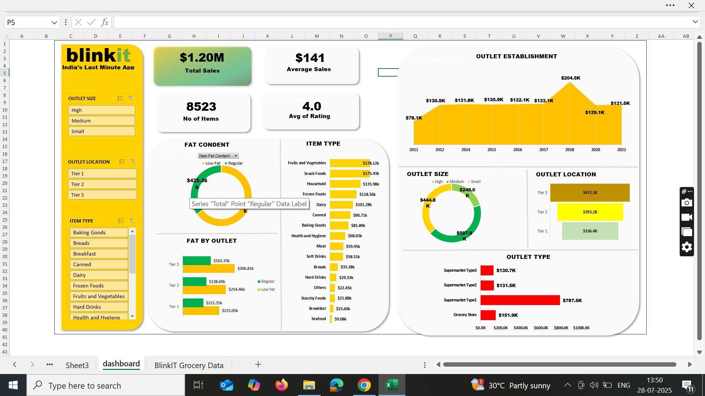

# 🛒 Blinkit Grocery Sales Dashboard (Excel)

This repository contains an interactive Excel dashboard analyzing Blinkit grocery sales data. It provides key insights into outlet performance, item categories, and sales trends over time.

## 📊 Dashboard Overview

The dashboard includes:

- 💰 *Total Sales*: $1.20M  
- 📦 *Number of Items*: 8,523  
- ⭐ *Average Rating*: 4.0  
- 💵 *Average Sales per Item*: $141

## 📌 Key Features

- 🏪 *Outlet Filters*: Size, Location, and Type
- 🍞 *Item Type Breakdown*: Sales by category like Snacks, Dairy, Beverages, etc.
- 📈 *Yearly Trend*: Outlet establishment over years (2011–2022)
- 🧈 *Fat Content Analysis*: Low Fat vs Regular
- 🌍 *Geographical Distribution*: Sales by Tier 1, 2, and 3 cities
- 🏷 *Dynamic Visuals*: Donut and bar charts for interactive insights

## 📁 Files Included

- Blinkit_Grocery_Dashboard.xlsx: The full Excel dashboard
- dashboard_screenshot.png: Preview of the dashboard

## 🧰 Tools Used

- Microsoft Excel  
- Pivot Tables  
- Slicers & Filters  
- Data Validation  
- Conditional Formatting  
- Charts & KPIs

## 🖼 Dashboard Preview

> Note: This dashboard is built using sample sales data for practice and portfolio purposes.

---

## 👤 Author

*Amith Raj*  
📧 Email: [amithtraj2003@gmail.com]( amithtraj2003@gmail.com)
🔗 LinkedIn: [https://www.linkedin.com/in/amith-raj-sr-665820325/](https://www.linkedin.com/in/amith-raj-sr-665820325/)
📂 Portfolio: [GitHub Profile](https://github.com/amith258)

---
